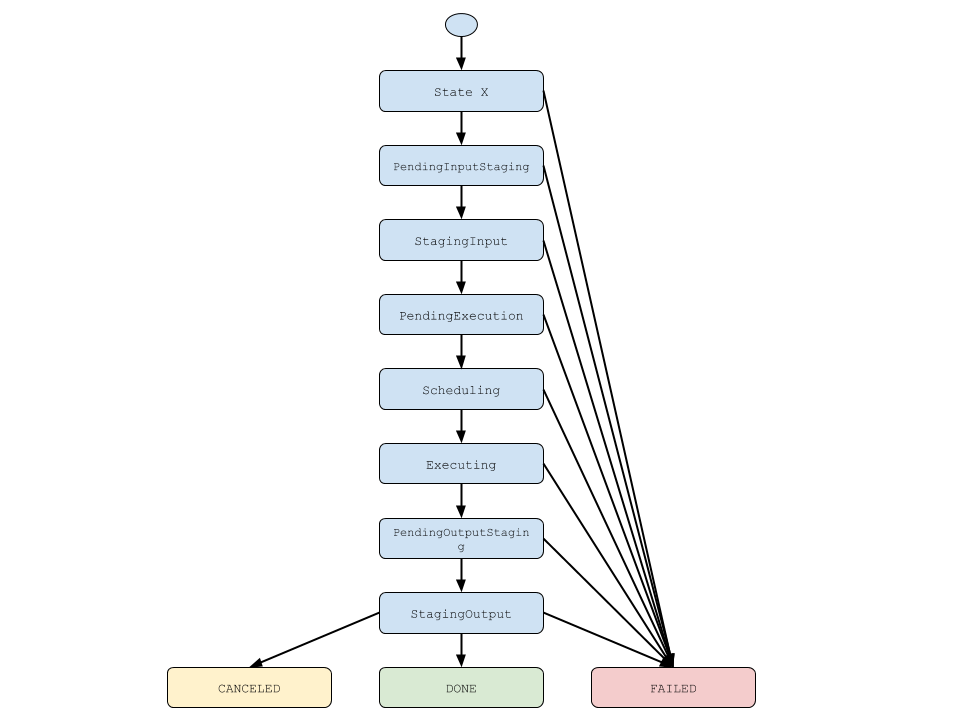
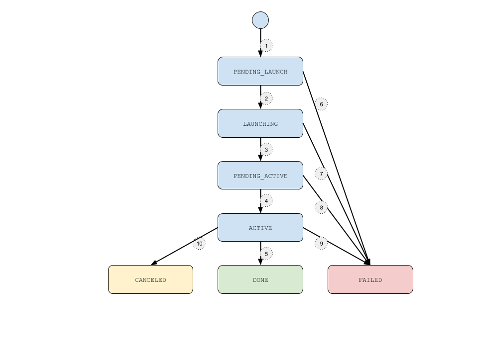

.. _chapter_api_reference:

*************
API Reference
*************

.. toctree::

Sessions and Security Contexts
==============================

Sessions
--------
.. autoclass:: radical.pilot.Session
   :members: Session
   :special-members: __init__

Security Contexts
-----------------
.. autoclass:: radical.pilot.Context
   :members: Context
   :special-members: __init__

Pilots and PilotManagers
========================

PilotManagers
-------------
.. autoclass:: radical.pilot.PilotManager
   :members: PilotManager
   :special-members: __init__

ComputePilotDescription
-----------------------
.. autoclass:: radical.pilot.ComputePilotDescription
   :members: ComputePilotDescription

Pilots
------
.. autoclass:: radical.pilot.ComputePilot
   :members: ComputePilot

ComputeUnits and UnitManagers
=============================

UnitManager
-----------
.. autoclass:: radical.pilot.UnitManager
   :members: UnitManager
   :special-members: __init__

ComputeUnitDescription
-----------------------
.. autoclass:: radical.pilot.ComputeUnitDescription
   :members: ComputeUnitDescription

ComputeUnit
-----------
.. autoclass:: radical.pilot.ComputeUnit
   :members: ComputeUnit

Exceptions
==========

.. autoclass:: radical.pilot.PilotException
   :members: PilotException

.. autoclass:: radical.pilot.DatabaseError
   :members: DatabaseError

State Models
============

ComputeUnit State Model
-----------------------

ComputePilot State Model
------------------------

#. A new compute pilot is launched via :func:`radical.pilot.PilotManager.submit_pilots`

#. The pilot is submitted to the remote resource and enters ``LAUNCHING`` state.

#. The pilot has been succesfully launched on the remote machine and is now waiting to become ``ACTIVE``.

#. The pilot has been launched by the queueing system and is now in ``ACTIVE STATE``.

#. The pilot has finished execution regularly and enters ``DONE`` state.

#. An error has occured during preparation for pilot launching and the pilot enters ``FAILED`` state.

#. An error has occured during pilot launching and the pilot enters ``FAILED`` state.

#. An error has occured on the backend and the pilot couldn't become active and the pilot enters ``FAILED`` state.

#. An error has occured during pilot runtime and the pilot enters ``FAILED`` state.

#. The active pilot has been canceled via the :func:`radical.pilot.ComputePilot.cancel` call and enters ``CANCELED`` state.