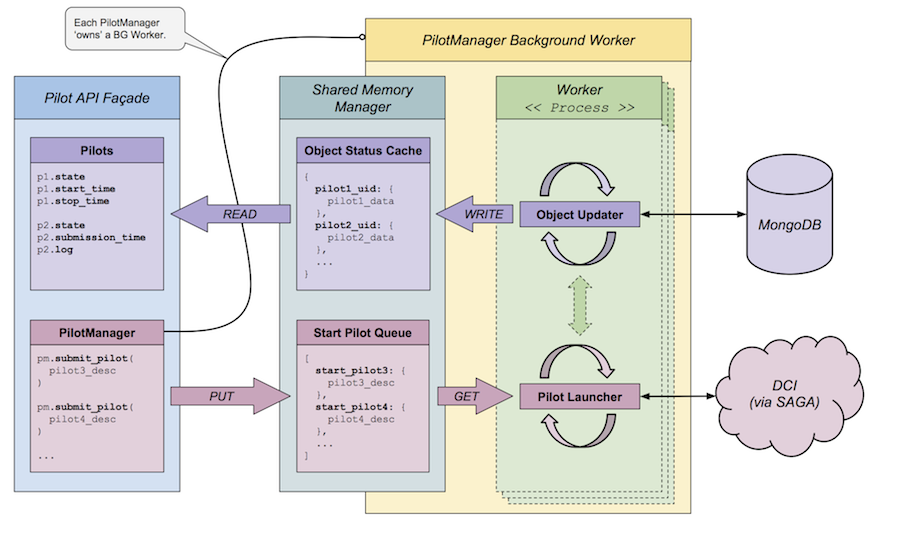
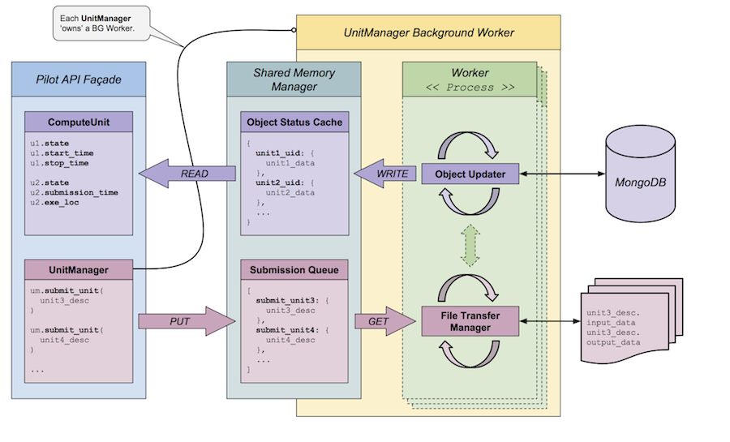

.. _chapter_developers:

***********************
Developer Documentation 
***********************

Installation from Source
========================

If you are planning to contribute to the RADICAL-Pilot codebase, or if you want 
to use the latest and greatest development features, you can download
and install RADICAL-Pilot directly from the sources.

First, you need to check out the sources from GitHub.

.. code-block:: bash

    git clone https://github.com/radical-cybertools/radical.pilot.git

Next, run the installer directly from the source directoy (assuming you have 
set up a vritualenv):

.. code-block:: bash
 
    pip install --upgrade .
    
    
License
=======

RADICAL-Pilot uses the MIT License (https://github.com/radical-cybertools/radical.pilot/blob/devel/LICENSE.md).

Style Guide
===========

To maintain consistency and uniformity we request people to try to follow our coding style guide lines.

We generally follow PEP 8 (http://legacy.python.org/dev/peps/pep-0008/), with currently one explicit exception:

  - When alignment of assignments improves readability.

Debugging 
=========

The `RADICAL_PILOT_VERBOSE` environment variable controls the debug output of 
a RADICAL-Pilot application. Possible values are:

  * `debug`
  * `info`
  * `warning`
  * `error`

The environment variable `RADICAL_PILOT_AGENT_VERBOSE` controls the debug log
level of the agent process on the target resource.  If it is not set, the log
level from `RADICAL_PILOT_VERBOSE` is used.

RADICAL-Pilot Architecture
==========================

Describe architecture overview here.

PilotManager and PilotManager Worker
------------------------------------

Download :download:`PDF version <images/architecture_pilotmanager.pdf>`.

UnitManager and UnitManager Worker
----------------------------------

Download :download:`PDF version <images/architecture_unitmanager.pdf>`.

