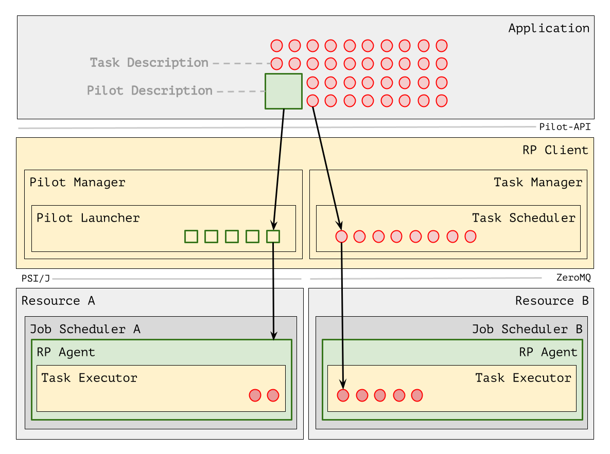

.. _chapter_design:

=========================
Design and Implementation
=========================

.. toctree::

RADICAL-Pilot is a distributed system that executes both a client and an agent
component. The client component executes on the same machine and the same
Python interpreter on which the application written against the RADICAL-Pilot
API executes. The agent executes either locally into a separate Python
interpreter or, most often, on a remote HPC machine into a dedicated Python
interpreter.

Figure 1 shows a high-level representation of RP architecture (yellow boxes)
when deployed on two HPC platforms (Resource A and B), executing an application
(Application) with 5 pilots (green boxes) and 36 tasks (red circles).
Application contains pilot and Task descriptions; RP Client has two components:
Pilot Manager and Task Manager. Pilot descriptions are passed to the Pilot
Manager and Task descriptions to the Task Manager. The Pilot Manager uses Pilot
Launcher to launch 2 of the 5 described pilots. One pilot is submitted to the
local Resource Management (RM) system of Resource A, the other pilot to the RM
of Resource B. Once instantiated, each pilot becomes available for Task
execution. At that point, RP Task Manager sends 2 tasks to Resource A and 5
tasks to Resource B.

 Figure 1. High-level view of RP architecture when deployed on a simplified
 view of two HPC platforms.

State Model
===========

Pilot and Task progress through linear state models.  The state names indicate
what RP module and component operate on the specific Pilot or Task entity.
Specifically, a Pilot or Task is, at any point in time, either owned by a RP
component or is waiting in a Queue to be communicated between components.

Pilot
-----

.. csv-table:: Pilot States
  :header: "State Name",    "Module",        "Component",      "Action"
  :widths: auto

  "NEW",                    "Pilot Manager", "",               "Creating a pilot"
  "PMGR_LAUNCHING_PENDING", "Pilot Manager", "Launcher queue", "Pilot waits for submission"
  "PMGR_LAUNCHING",         "Pilot Manager", "Pilot Launcher", "Submit a pilot to the batch system"
  "PMGR_ACTIVE_PENDING",    "LRM",           "",               "Pilot is waiting in the batch queue or bootstrapping"
  "PMGR_ACTIVE",            "LRM",           "",               "Pilot is active on the cluster resources"
  "DONE",                   "Pilot Manager", "",               "Pilot marked as done. Final state"
  "CANCELED",               "Pilot Manager", "",               "Pilot marked as cancelled. Final state"
  "FAILED",                 "Pilot Manager", "",               "Pilot marked as failed. Final state"

Task
----

.. csv-table:: Task States
  :header: "State Name",          "Module",       "Component",        "Action"
  :widths: auto

  "NEW",                          "Task Manager", "",                 "Creating a task"
  "TMGR_SCHEDULING_PENDING",      "Task Manager", "Scheduler queue",  "Task queued for scheduling on a pilot"
  "TMGR_SCHEDULING",              "Task Manager", "Scheduler",        "Assigning task to a pilot"
  "TMGR_STAGING_INPUT_PENDING",   "Task Manager", "Stager In queue",  "Task queued for data staging"
  "TMGR_STAGING_INPUT",           "Task Manager", "Stager In",        "Staging task's files to the target platform (if any)"
  "AGENT_STAGING_INPUT_PENDING",  "Agent",        "Stager In queue",  "Task waiting to be picked up by Agent"
  "AGENT_STAGING_INPUT",          "Agent",        "Stager In",        "Staging task's files inside the target platform, making available within the task sandbox"
  "AGENT_SCHEDULING_PENDING",     "Agent",        "Scheduler queue",  "Task waiting for scheduling on resources, i.e., cores and/or GPUs"
  "AGENT_SCHEDULING",             "Agent",        "Scheduler",        "Assign cores and/or GPUs to the task"
  "AGENT_EXECUTING_PENDING",      "Agent",        "Executor queue",   "Cores and/or GPUs are assigned, wait for execution"
  "AGENT_EXECUTING",              "Agent",        "Executor",         "Executing tasks on assigned cores and/or GPUs. Available resources are utilized"
  "AGENT_STAGING_OUTPUT_PENDING", "Agent",        "Stager Out queue", "Task completed and waits for output staging"
  "AGENT_STAGING_OUTPUT",         "Agent",        "Stager Out",       "Staging out task files within the platform (if any)"
  "TMGR_STAGING_OUTPUT_PENDING",  "Task Manager", "Stager Out queue", "Waiting for Task Manager to pick up Task again"
  "TMGR_STAGING_OUTPUT",          "Task Manager", "Stager Out",       "Task's files staged from remote to local resource (if any)"
  "DONE",                         "Task Manager", "",                 "Task marked as done. Final state"
  "CANCELED",                     "Task Manager", "",                 "Task marked as cancelled. Final state"
  "FAILED",                       "Task Manager", "",                 "Task marked as failed. Final state"

Event Model
===========

Events marked as ``optional`` depend on the content of task descriptions etc,
all other events will usually be present in 'normal' runs. All events have an
event name, a timestamp, and a component (which recorded the event) defined -
all other fields (uid, state, msg) are optional. The names of the actual
component IDs depend on the exact RP configuration and startup sequence.

The exact order and multiplicity of events is ill-defined, as they depend on
many boundary conditions: system properties, system noise, system
synchronization, RP API call order, application timings, RP configuration,
resource configuration, and noise. However, while a global event model is thus
hard to define, the order presented in the lists below gives some basic
indication on event ordering *within each individual component*.

Format of this file
-------------------

::

   event_name          : semantic event description (details on 'uid', 'msg', 'state' fields)

All Components
--------------

::

   get                 : component receives an entity               (uid: eid, state: estate)
   advance             : component advances  entity state           (uid: eid, state: estate)
   publish             : component publishes entity state           (uid: eid, state: estate)
   put                 : component pushes an entity out             (uid: eid, state: estate, msg: channel)
   lost                : component lost   an entity (state error)   (uid: eid, state: estate)
   drop                : component drops  an entity (final state)   (uid: eid, state: estate)
   component_init      : component child  initializes after start()
   component_init      : component parent initializes after start()
   component_final     : component finalizes

   partial orders
   * per component     : component_init, *, component_final
   * per entity        : get, advance, publish, put

Session (Component)
-------------------

::

   session_start       : session is being created (not reconnected) (uid: sid)
   session_close       : session close is requested                 (uid: sid)
   session_stop        : session is closed                          (uid: sid)
   session_fetch_start : start fetching logs/profs/json after close (uid: sid, [API])
   session_fetch_stop  : stops fetching logs/profs/json after close (uid: sid, [API])

   partial orders
   * per session       : session_start, config_parser_start, \
                         config_parser_stop, session_close,  \
                         session_stop,  session_fetch_start, \
                         session_fetch_stop

PilotManager (Component)
------------------------

::

   setup_done          : manager has bootstrapped                   (uid: pmgr)

PMGRLaunchingComponent (Component)
----------------------------------

::

   staging_in_start    : pilot sandbox staging starts               (uid: pilot)
   staging_in_stop     : pilot sandbox staging stops                (uid: pilot)
   submission_start    : pilot job submission starts                (uid: pilot)
   submission_stop     : pilot job submission stops                 (uid: pilot)

   partial orders
   * per pilot         : staging_in_start, staging_in_stop, \
                         submission_start, submission_stop

Pilot (in session profile, all optional)
----------------------------------------

::

   staging_in_start    : pilot level staging request starts         (uid: pilot, msg: did, [PILOT-DS])
   staging_in_fail     : pilot level staging request failed         (uid: pilot, msg: did, [PILOT-DS])
   staging_in_stop     : pilot level staging request stops          (uid: pilot, msg: did, [PILOT-DS])

   partial orders
   * per file          : staging_in_start, (staging_in_fail | staging_in_stop)

TaskManager (Component)
-----------------------

::

   setup_done          : manager has bootstrapped                   (uid: tmgr)
   get                 : tasks   received from application          (uid: tmgr, msg: 'bulk size: %d')
   get                 : task    received from application          (uid: task)

TMGRSchedulingComponent (Component)
-----------------------------------

TMGRStagingInputComponent (Component)
-------------------------------------

::

   create_sandbox_start: create_task_sandbox starts                 (uid: task, [Task-DS])
   create_sandbox_stop : create_task_sandbox stops                  (uid: task, [Task-DS])
   staging_in_start    : staging request starts                     (uid: task, msg: did, [Task-DS])
   staging_in_stop     : staging request stops                      (uid: task, msg: did, [Task-DS])
   staging_in_tar_start: tar optimization starts                    (uid: task, msg: did, [Task-DS])
   staging_in_tar_stop : tar optimization stops                     (uid: task, msg: did, [Task-DS])

   partial orders
   * per task          : create_sandbox_start, create_sandbox_stop,
                         (staging_in_start | staging_in_stop)*
   * per file          : staging_in_start, staging_in_stop

bootstrap_0.sh
--------------

::

   bootstrap_0_start   : pilot bootstrapper 1 starts                (uid: pilot)
   tunnel_setup_start  : setting up tunnel    starts                (uid: pilot)
   tunnel_setup_stop   : setting up tunnel    stops                 (uid: pilot, [CFG-R])
   ve_setup_start      : pilot ve setup       starts                (uid: pilot)
   ve_create_start     : pilot ve creation    starts                (uid: pilot, [CFG-R])
   ve_activate_start   : pilot ve activation  starts                (uid: pilot, [CFG-R])
   ve_activate_start   : pilot ve activation  stops                 (uid: pilot, [CFG-R])
   ve_update_start     : pilot ve update      starts                (uid: pilot, [CFG-R])
   ve_update_start     : pilot ve update      stops                 (uid: pilot, [CFG-R])
   ve_create_stop      : pilot ve creation    stops                 (uid: pilot, [CFG-R])
   rp_install_start    : rp stack install     starts                (uid: pilot, [CFG-R])
   rp_install_stop     : rp stack install     stops                 (uid: pilot, [CFG-R])
   ve_setup_stop       : pilot ve setup       stops                 (uid: pilot, [CFG-R])
   ve_activate_start   : pilot ve activation  starts                (uid: pilot, [CFG-R])
   ve_activate_start   : pilot ve activation  stops                 (uid: pilot)
   cleanup_start       : sandbox deletion     starts                (uid: pilot)
   cleanup_stop        : sandbox deletion     stops                 (uid: pilot)
   bootstrap_0_stop    : pilot bootstrapper 1 stops                 (uid: pilot)

   partial orders
   * as above

agent_0 (Component)
-------------------

::

   hostname            : host or nodename for agent_0               (uid: pilot)
   cmd                 : command received from pmgr                 (uid: pilot, msg: command, [API])
   get                 : tasks   received from task manager         (uid: pilot, msg: 'bulk size: %d')
   get                 : task    received from task manager         (uid: task)
   dvm_start           : DVM startup by launch method               (uid: pilot, msg: 'dvm_id=%d') [CFG-DVM])
   dvm_uri             : DVM URI is set successfully                (uid: pilot, msg: 'dvm_id=%d') [CFG-DVM])
   dvm_ready           : DVM is ready for execution                 (uid: pilot, msg: 'dvm_id=%d') [CFG-DVM])
   dvm_stop            : DVM terminated                             (uid: pilot, msg: 'dvm_id=%d') [CFG-DVM])
   dvm_fail            : DVM termination failed                     (uid: pilot, msg: 'dvm_id=%d') [CFG-DVM])

   partial orders
   * per instance      : hostname, (cmd | get)*
   * per instance      : dvm_start, dvm_uri, dvm_ready, (dvm_stop | dvm_fail)

AgentStagingInputComponent (Component)
--------------------------------------

::

   staging_in_start    : staging request starts                     (uid: task, msg: did, [Task-DS])
   staging_in_skip     : staging request is not handled here        (uid: task, msg: did, [Task-DS])
   staging_in_fail     : staging request failed                     (uid: task, msg: did, [Task-DS])
   staging_in_stop     : staging request stops                      (uid: task, msg: did, [Task-DS])

   partial orders
   * per file          : staging_in_skip
                       | (staging_in_start, (staging_in_fail | staging_in_stop))

AgentSchedulingComponent (Component)
------------------------------------

::

   schedule_try        : search for task resources starts           (uid: task)
   schedule_fail       : search for task resources failed           (uid: task, [RUNTIME])
   schedule_ok         : search for task resources succeeded        (uid: task)

   unschedule_start    : task resource freeing starts               (uid: task)
   unschedule_stop     : task resource freeing stops                (uid: task)

   partial orders
   * per task          : schedule_try, schedule_fail*, schedule_ok, \
                         unschedule_start, unschedule_stop

AgentExecutingComponent: (Component)
------------------------------------

::

   task_start          : task handling process starts               (uid: task)
   task_mkdir          : creation of sandbox requested              (uid: task)
   task_mkdir_done     : creation of sandbox completed              (uid: task)
   task_run_start      : pass to executing layer (ssh, mpi...)      (uid: task)
   task_run_ok         : executing layer accepted task              (uid: task)
   launch_start        : task launch script: starts                 (uid: task)
   launch_pre          : task launch script: pre-submission         (uid: task)
   launch_submit       : task launch script: launch method starts   (uid: task)
   exec_start          : task exec script: starts [per rank]        (uid: task)
   exec_pre            : task exec script: pre-exec starts          (uid: task)
   rank_start          : task exec script: executable started       (uid: task)
   app_start           : application executable started             (uid: task, [APP])
   app_*               : application specific events                (uid: task, [APP], optional)
   app_stop            : application executable stops               (uid: task, [APP])
   rank_stop           : task exec script: executable stopped       (uid: task)
   exec_post           : task exec script: post-exec starts         (uid: task)
   exec_stop           : task exec script: stopped                  (uid: task)
   launch_collect      : task launch script: launch method returned (uid: task)
   launch_post         : task launch script: post-submission        (uid: task)
   launch_stop         : task launch script: completes              (uid: task)
   task_run_stop       : exec layer passed back control             (uid: task)

   task_run_cancel_start: try to cancel task via exec layer (kill)  (uid: task, [API])
   task_run_cancel_stop : did cancel    task via exec layer (kill)  (uid: task, [API])

   partial orders
   * per task          : task_start, task_run_start, task_run_ok,
                         launch_start, launch_pre, launch_submit, exec_start,
                         exec_pre, rank_start, app_start, app_*, app_stop,
                         rank_stop, exec_post, exec_stop, launch_collect,
                         launch_post, launch_stop, task_run_stop
   * per task          : task_run_cancel_start, task_run_cancel_stop

   NOTE: raptor tasks will not log the complete set of events - they will miss
   the launch_* events (raptor has not separate launcher), the exec_pre and
   exec_post events (pre and post exec are not supported), and the task_mkdir_*
   events (raptor tasks don't have individual sandboxes).

AgentStagingOutputComponent (Component)
---------------------------------------

::

   staging_stdout_start: reading task stdout starts                 (uid: task)
   staging_stdout_stop : reading task stdout stops                  (uid: task)
   staging_stderr_start: reading task stderr starts                 (uid: task)
   staging_stderr_stop : reading task stderr stops                  (uid: task)
   staging_uprof_start : reading task profile starts                (uid: task, [APP])
   staging_uprof_stop  : reading task profile stops                 (uid: task, [APP])
   staging_out_start   : staging request starts                     (uid: task, msg: did, [Task-DS])
   staging_out_skip    : staging request is not handled here        (uid: task, msg: did, [Task-DS])
   staging_out_fail    : staging request failed                     (uid: task, msg: did, [Task-DS])
   staging_out_stop    : staging request stops                      (uid: task, msg: did, [Task-DS])

   partial orders
   * per task          : staging_stdout_start, staging_stdout_stop,
                         staging_stderr_start, staging_stderr_stop,
                         staging_uprof_start,  staging_uprof_stop,
   * per file          : staging_out_skip \
                       | (staging_out_start, (staging_out_fail | staging_out_stop))

TMGRStagingOutputComponent (Component)
--------------------------------------

::

   staging_out_start   : staging request starts                     (uid: task, msg: did, [Task-DS])
   staging_out_stop    : staging request stops                      (uid: task, msg: did, [Task-DS])

   partial orders
   * per file          : staging_out_start, staging_out_stop

UpdateWorker (Component)
------------------------

::

   update_request      : a state update is requested                (uid: task, msg: state)
   update_pushed       : bulk state update has been sent            (           msg: 'bulk size: %d')
   update_pushed       : a state update has been send               (uid: task, msg: state)

   partial orders
   * per state update  : update_request, update_pushed

All profiles
------------

::

   sync_abs            : sets an absolute, NTP synced time stamp               ([INTERNAL])
   END                 : last entry, profiler is being closed

   partial orders
   * per profile       : sync_abs, *, END

Conditional events
------------------

::

   - [API]           - only for corresponding RP API calls
   - [CFG]           - only for some RP configurations
     - [CFG-R]       - only for some bootstrapping configurations
     - [CFG-DVM]     - only for launch methods which use a DVM
   - [Task]            - only for some Task descriptions
     - [Task-DS]       - only for tasks specifying data staging directives
     - [Task-PRE]      - only for tasks specifying pre-exec directives
     - [Task-POST]     - only for tasks specifying post-exec directives
   - [PILOT]         - only for certain pilot
   - [APP]           - only for applications writing compatible profiles
   - [RUNTIME]       - only on  certain runtime decisions and system configuration
   - [INTERNAL]      - only for certain internal states
