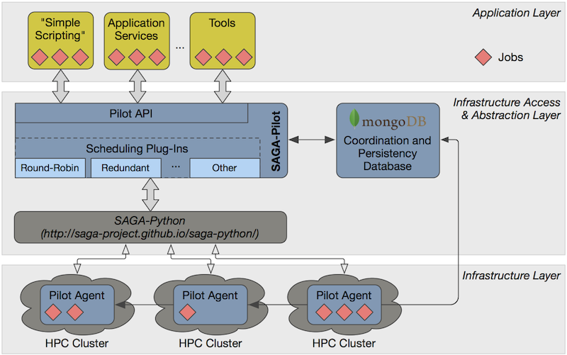

.. _chapter_overview:

************************
RADICAL-Pilot - Overview
************************

This section provides a conceptual overview about RADICAL-Pilot (RP).  You will
learn what problems RP aims to solve for you.  You will also be introduced to
some vocabulary, and the overall RP architecture and operation.

We will keep the information on a very general level, and will avoid any details
which will not contribute to the user experience.  Having said that, feel free
to skip ahead to the :ref:`chapter_user_guide` if you are more interested in
directly diving into the thick of using RP!

What Problems does RP solve?
============================

RP attempts to support in running applications on distributed resources, and
focuses on two aspects:

  * abstract the heterogeneity of distributed resources, so that running
    applications is uniform across them, from a users perspective; 

  * support the efficient execution of large numbers of concurrent or sequential
    application instances.

What is a Pilot?
================

The ``Pilot`` in RADICAL-Pilot stands for a job-container like construct which
manages a part (`slice`) of a remote resource on the user's (or application's)
behalf, and which executes sequences of ``ComputeUnits`` on that resource slice.

RP applications will, in general, first define a set of such pilots, ie. the set
of target resources, the size of the resource slice to manage, etc), and then
submit those pilots to the resources.  Once the pilots are defined, the
application can send them ``ComputeUnits`` (see below) for execution.

What is a Compute Unit (CU)?
============================

An RP ComputeUnit (CU, or 'unit') represents a self-contained, executable part
of the application's workload.  A CU is described by the following attributes
(for details, check out the :class:`API documentation <radical.pilot.ComputeUnitDescription>`):

  * `executable`    : the name of the executable to be run on the target machines
  * `arguments`     : a list of argument strings to be passed to the executable
  * `environment`   : a dictionary of environment variable/value pairs to be set
    before unit execution
  * `input_staging` : a set of staging directives for input data
  * `output_staging`: a set of staging directives for output data

How about data?
===============

Data management is important for executing CUs, both in providing input data,
and staging/sharing output data.  RP has different means to handle data, and
they are specifically covered in sections
:ref:`in <chapter_user_guide_06>`
:ref:`the <chapter_user_guide_07>`
:ref:`UserGuide <chapter_user_guide_08>`.

Why do I need a MongoDB to run RP?
==================================

The RP application uses a MongoDB database to communicate with the pilots it
created: upon startup, the pilots will connect to the database and look for CUs
to execute.  Similarly, pilots will push information into the database, such as
about units which completed execution.

How do I know what goes on in the pilot? With my CUs?
=====================================================

There are many aspects to that question.  First, pilots and units progress
according to well defined state models:

.. image:: global-state-model-plain.png
    :width: 400pt

``pilot.state`` and ``unit.state`` will always report the current state of the
entities.

Callbacks can be registered for notifications on unit and pilot state changes.

Setting ``RADICAL_PILOT_LOG_LVL=INFO`` will turn on logging, which provides
very detailed information about RP's inner functionality.  Pilots running on
target resources also create log files (those should only be useful for
debugging purposes).

What about logging and profiling?
=================================

RP supports logging to the terminal and to files.  Also, profiles can be written
during runtime. You can set the following variables:

    RADICAL_PILOT_LOG_LVL=DEBUG
    RADICAL_PILOT_LOG_TGT=/tmp/rp.log
    RADICAL_PILOT_PROFILE=True

The defined verbosity levels are the same as defined by Python's logging module

