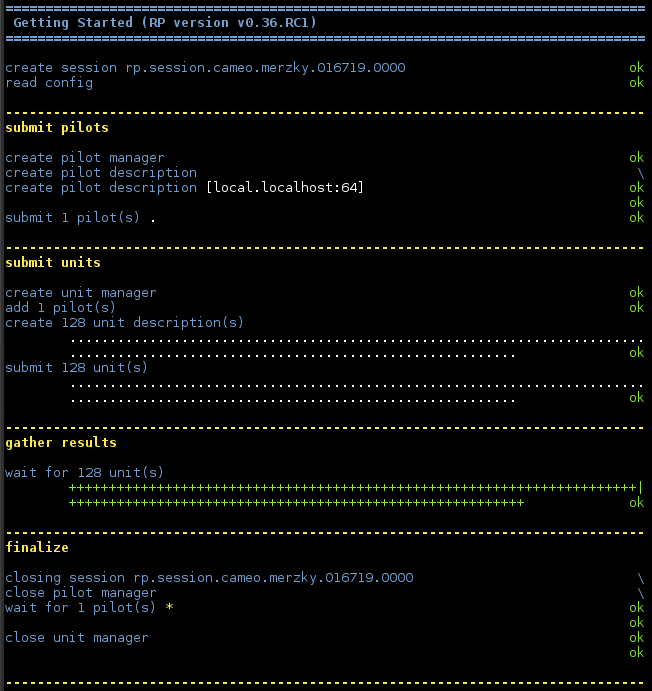

.. _chapter_user_guide_00:

***************
Getting Started
***************

In this section we will walk you through the basics of using  RP.  After you
have worked through this chapter, you will understand how to launch a local
``ComputePilot`` and use a ``UnitManager`` to schedule and run ``ComputeUnits``
(tasks) on it.

.. note:: The reader is assumed to be familiar with the general RP concepts as
          described in :ref:`chapter_overview` for reference.

.. note:: This chapter assumes that you have successfully installed
          RADICAL-Pilot, and also configured access to the resources you intent
          to use for the examples (see chapter :ref:`chapter_installation`).

.. note:: We colloquially refer to ``ComputePilot`` as `pilot`, and to
          ``ComputeUnit`` as `unit`.

You can download the basic :download:`00_getting_started.py
<../../../examples/00_getting_started.py>`.  The text below will explain the
most important code sections, and at the end shows the expected output
from the execution of the example.  Please look carefully at the code comments as
they explain some aspects of the code which are not explicitly covered in the
text below.  

Loading the RP Module, Follow the Application Execution
-------------------------------------------------------

In order to use RADICAL-Pilot, you need to import the ``radical.pilot`` module (we use the `rp` abbreviation for the module name) 
in your Python script or application:

.. code-block:: python

    import radical.pilot as rp

All example scripts used in this user guide use the ``LogReporter``
facility (of RADICAL-Utils) to print runtime and progress information.  You can
control that output with the ``RADICAL_PILOT_VERBOSE`` variable, which can be set
to the normal Python logging levels, and to the value ``REPORT`` to obtain well
formatted output.  We assume the ``REPORT`` setting to be used when referencing
any output in this chapter.

.. code-block:: python

    os.environ['RADICAL_PILOT_VERBOSE'] = 'REPORT'

    import radical.pilot as rp
    import radical.utils as ru

    report = ru.LogReporter(name='radical.pilot')
    report.title('Getting Started (RP version %s)' % rp.version)

Creating a Session
------------------

A :class:`radical.pilot.Session` is the root object for all other objects in
RADICAL- Pilot.  :class:`radical.pilot.PilotManager` and
:class:`radical.pilot.UnitManager` instances are always attached to a Session,
and their lifetime is controlled by the session.

A Session also encapsulates the connection(s) to a backend `MongoDB
<http://www.mongodb.org/>`_ server which facilitates the communication between
the RP application and the remote pilot jobs.  More information about how
RADICAL-Pilot uses MongoDB can be found in the :ref:`chapter_overview` section.

To create a new Session, the only thing you need to provide is the URL of
a MongoDB server.  If no MongoDB URL is specified on session creation, RP
attempts to use the value specified via the ``RADICAL_PILOT_DBURL`` environment
variable.

.. code-block:: python

    os.environ['RADICAL_PILOT_DBURL'] = 'mongodb://db.host.net:27017/<db_name>'

    session = rp.Session()

.. warning:: Always call  :func:`radical.pilot.Session.close` before your
   application terminates. This will terminate all lingering pilots and cleans
   out the database entries of the session.

Creating ComputePilots
----------------------

A :class:`radical.pilot.ComputePilot` is responsible for ``ComputeUnit`` execution.
Pilots can be launched either locally or remotely, and 
they can manage a single node or a large number of nodes on a cluster.

Pilots are created via a :class:`radical.pilot.PilotManager`, by passing
a :class:`radical.pilot.ComputePilotDescription`.  The most important elements
of the ``ComputePilotDescription`` are

    * `resource`: a label which specifies the target resource to run the pilot
      on, ie. the location of the pilot;
    * `cores`   : the number of CPU cores the pilot is expected to manage, ie.
      the size of the pilot;
    * `runtime` : the numbers of minutes the pilot is expected to be active, ie.
      the runtime of the pilot.

Depending on the specific target resource and use case, other properties need
to be specified.  In our user guide examples, we use a separate
`config.json<../../../examples/config.json>` file to store a number of
properties per resource label, to simplify the example code.  The examples
themselves then accept one or more resource labels, and create the pilots on
those resources:

.. code-block:: python

    # use the resource specified as argument, fall back to localhost
    try   : resource = sys.argv[1]
    except: resource = 'local.localhost'

    # create a pilot manage in the session
    pmgr = rp.PilotManager(session=session)

    # define an [n]-core local pilot that runs for [x] minutes
    pdesc = rp.ComputePilotDescription({
            'resource'      : resource,
            'cores'         : 64,  # pilot size
            'runtime'       : 10,  # pilot runtime (min)
            'project'       : config[resource]['project'],
            'queue'         : config[resource]['queue'],
            'access_schema' : config[resource]['schema']
            }

    # submit the pilot for launching
    pilot = pmgr.submit_pilots(pdesc)

For a list of available resource labels, see :ref:`chapter_resources` (not all
of those resources are configured for the userguide examples).  For further
details on the pilot description, please check the :class:`API Documentation
<radical.pilot.ComputePilotDescription>`.

.. warning:: Note that the submitted pilot agent **will not terminate** 
    when your Python scripts finishes. Pilot agents terminate only after
    they have reached their ``runtime`` limit, are killed by the target system,
    or if you explicitly cancel them via :func:`radical.pilot.Pilot.cancel`,
    :func:`radical.pilot.PilotManager.cancel_pilots`, or
    :func:`radical.pilot.Session.close(terminate=True)`.

Submitting ComputeUnits
-----------------------

After you have launched a pilot, you can now generate
:class:`radical.pilot.ComputeUnit`  objects for the pilot to execute. You
can think of a ``ComputeUnit`` as something very similar to an operating system
process that consists of an ``executable``, a list of ``arguments``, and an
``environment`` along with some runtime requirements.

Analogous to pilots, a units is described via a
:class:`radical.pilot.ComputeUnitDescription` object. The mandatory properties
that you need to define are:

   * ``executable`` - the executable to launch
   * ``cores``      - the number of cores required by the executable

Our basic example creates 128 units which each run `/bin/date`:

.. code-block:: python

        n    = 128   # number of units to run
        cuds = list()
        for i in range(0, n):
            # create a new CU description, and fill it.
            cud = rp.ComputeUnitDescription()
            cud.executable = '/bin/date'
            cuds.append(cud)

Units are executed by pilots.  The `:class:radical.pilot.UnitManager`
class is responsible for routing those units from the application to the
available pilots.  The ``UnitManager`` accepts ``ComputeUnitDescriptions`` as we
created above and assigns them, according to some scheduling algorithm, to the
set of available pilots for execution (pilots are made available to a 
``UnitManager`` via the ``add_pilot`` call):

.. code-block:: python

        # create a unit manager, submit units, and wait for their completion
        umgr = rp.UnitManager(session=session)
        umgr.add_pilots(pilot)
        umgr.submit_units(cuds)
        umgr.wait_units()

Running the Example
-------------------

.. note::  Remember to set `RADICAL_PILOT_DBURL` in you environment (see chapter
           :ref:`chapter_installation`).

Running the example will result in an output similar to the one shown below:

The runtime can vary significantly, and typically the first run on any resource will be longest.
This is because the first time RP is  used on a new resource for a specific user,
it will set up a Python virtualenv for the pilot to use.  Subsequent runs may
update that virtualenv, or may install additional components as needed, but that
should take less time than its creation.  So please allow for a couple of
minutes on the first execution (depending on your network connectivity, the
connectivity of the target resource, and the location of the MongoDB service).

What's Next?
------------

The next user guide section (:ref:`chapter_user_guide_01`) will describe how an
application can inspect completed units for more detailed information,
such as exit codes and stdout/stderr.

