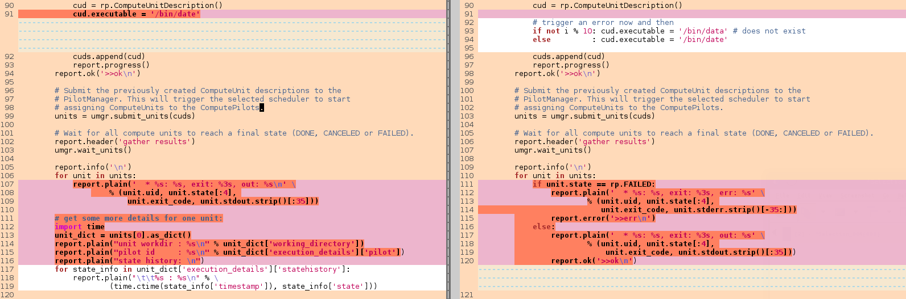
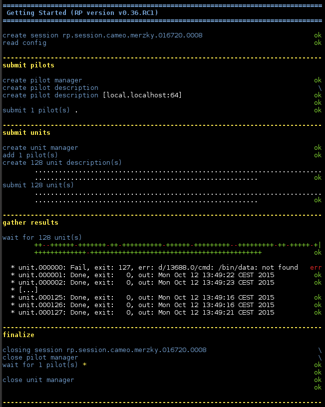

.. _chapter_user_guide_02:

********************
Handle Failing Units
********************

All applications can fail, often for reasons out of control of the user.
A ComputeUnit is no different, it can fail as well.  Many non-trivial
application will need to have a way to handle failing units -- detecting the
failure is the first and necessary step to do so, and RP makes that part easy:
RP's :ref:`unit state model <unit_state_model>` defines that a failing unit will
immediately go into `FAILED` state, and that state information is available as
`unit.state` property.  

The unit also has the `unit.stderr` property available for further inspection
into causes of the failure -- that will only be available though if the unit did
reach the `EXECUTING` state in the first place.  In other cases, the application
can inspect the `unit.as_dict()['execution_details']['log']` array of timed log
messages, similar to the `state_history` array discussed :ref:`before
<chapter_user_guide_01>`.

You can download the script :download:`02_failing_units.py
<../../../examples/02_failing_units.py>`, which demonstrates inspection for
failed units.  It has the following diff to the previous example:

Instead of running an executable we are almost certain will succeed, we now and
then insert an intentional faulty one whose specified executable file does not
exist on the target system.  Upon state inspection, we expect to find a `FAILED`
state for those units, and a respective informative `stderr` output:

Running the Example
-------------------

Running the example will result in an output similar to the one shown below:

.. note:: You will see red glyphs during the result gathering phase, indicating
    that a failed unit has been collected.  The example output above also
    demonstrates an important feature: execution ordering of units is *not
    preserved*, that order is independent of the order of submission.  Any unit
    dependencies need to be resolved on application level!

What's Next?
------------

The next user guide section (:ref:`chapter_user_guide_03`) will return to the
basic example (ie. no failing units are expected), but will now submit those
units to more than one concurrent pilots.

