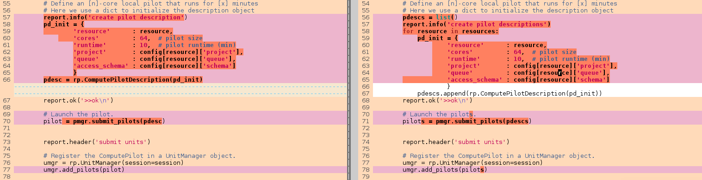
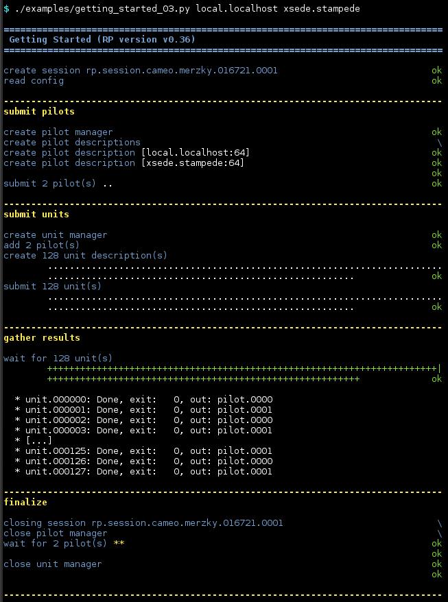

.. _chapter_user_guide_03:

*******************
Use Multiple Pilots
*******************

We have seen in the previous examples how an RP pilot acts as a container for
multiple compute unit executions.  There is in principle no limit on how many of
those pilots are used to execute a specific workload, and specifically, pilot
don't need to run on the same resource!

:download:`03_multiple_pilots.py <../../../examples/03_multiple_pilots.py>`
demonstrates that, and features the following diff to the previous examples:

Instead of creating *one* pilot description, we here create one for any resource
specified as command line parameter, no matter if those parameters point to the
same resource targets or not.

The units are distributed over the created set of pilots according to some
scheduling mechanism -- section :ref:`chapter_user_guide_04` will discuss how an
application can choose between different scheduling policies.  The default
policy used here is *Round Robin*.

Running the Example
-------------------

The workload of our example has now changed to report the respectively used
pilot on stdout, and the output shows that.  We here exemplarily start a pilot
on `local.localhost`, and one on `xsede.stampede`:

What's Next?
------------

Using multiple pilots is very powerful -- it becomes more powerful if you allow
RP to load-balance units between them.  :ref:`chapter_user_guide_04` will show
how to do just that.

