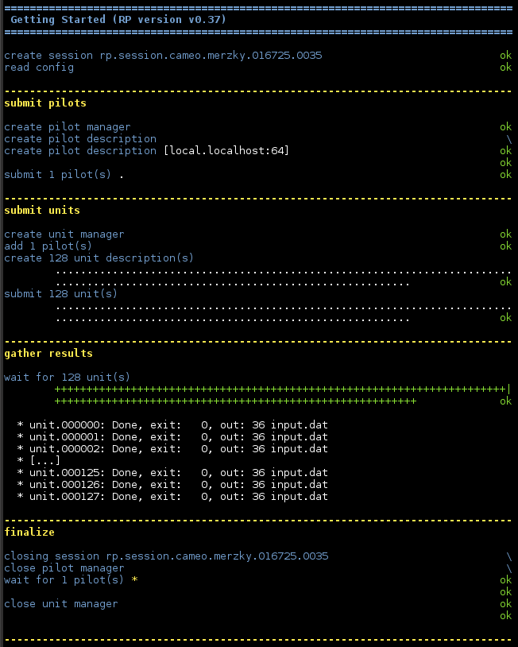

.. _chapter_user_guide_05:

***********************
Staging Unit Input Data
***********************

The vast majority of applications operate on data, and many of those read input
data from files.  Since RP provides an abstraction above the resource layer, it
can run a ComputeUnit on any pilot the application created (see
:ref:`chapter_user_guide_04`).  To ensure that the CU finds the data it needs on
the resource where it runs, RP provides a mechanism to stage input data
automatically.

For each compute unit, the application can specify

  * `source`: what data files need to be staged;
  * `target`: what should the path be in the context of the CU execution; 
  * `action`: how should data be staged.

If `source` and `target` file names are the same, and if `action` is the default
`rp.TRANSFER`, then you can simply specify CU input data by giving a list of
file names (we'll discuss more complex staging directives in a :ref:`later
<chapter_user_guide_06>` example):

.. code-block:: python

    cud = rp.ComputeUnitDescription()
    cud.executable     = '/usr/bin/wc'
    cud.arguments      = ['-c', 'input.dat']
    cud.input_staging  = ['input.dat']

:download:`05_unit_input_data.py <../../../examples/05_unit_input_data.py>`
contains an example application which uses the above code block.  It otherwise
does not differ from our earlier examples (but only adds on-th-fly creation of
`input.dat`).

Running the Example
-------------------

The result of this example's execution is straight forward, as expected, but
proves that the file staging happened as planned.  You will likely notice though
that the code runs significantly longer than earlier ones, because of the file
staging overhead -- we will discuss in :ref:`chapter_user_guide_07` how file
staging can be optimized for units which share the same input data.

What's Next?
------------

The obvious next step will be to handle output data:
:ref:`chapter_user_guide_06` will address exactly this, and also provide some
more details on different modes of data staging, before
:ref:`chapter_user_guide_07` will introduce RP's capability to share data
between different compute units.

