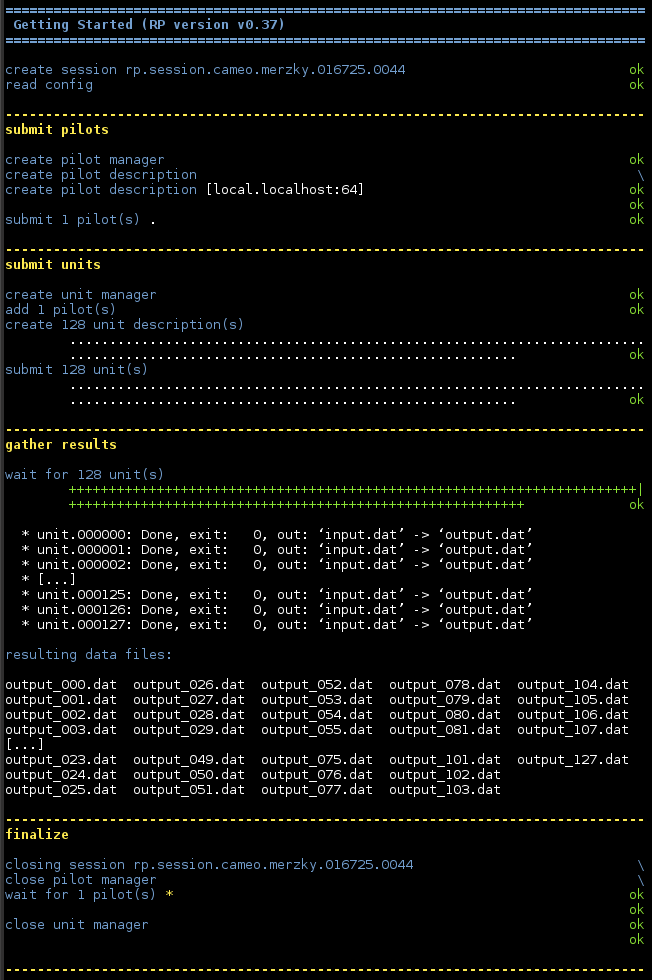

.. _chapter_user_guide_06:

************************
Staging Unit Output Data
************************

Upon completion, units have often creates some amount of data. We have seen in
:ref:`chapter_user_guide_01` how we can inspect the unit's ``stdout`` string,
but that will not be useful beyond the most trivial workloads. This section
shows how to stage the output data of units back to the RP application, and/or
to arbitrary storage locations and devices.

In principle, output staging is specified as the input staging discussed in
the :ref:`previous <chapter_user_guide_05>` section:

  * ``source``: what files need to be staged from the context of the unit that
                terminated execution;
  * ``target``: where should the files be staged to;
  * ``action``: how should files be staged.

Note that in this example we specify the output file name to be changed to a
unique name during staging:

.. code-block:: python

    for i in range(0, n):
        cud.executable     = '/bin/cp'
        cud.arguments      = ['-v', 'input.dat', 'output.dat']
        cud.input_staging  = ['input.dat']
        cud.output_staging = {'source': 'output.dat', 
                              'target': 'output_%03d.dat' % i,
                              'action': rp.TRANSFER}

:download:`06_unit_output_data.py <../../../examples/06_unit_output_data.py>`
is an example application which uses the code block above. 

.. It otherwise does not significantly differ from our previous example.

Running the Example
-------------------

The result of this example's execution shows that the output files have been
renamed during the output-staging phase:

What's Next?
------------

We look into an optimization which is important for a large set of use cases:
the :ref:`sharing of input data <chapter_user_guide_07>` among multiple
compute units.

