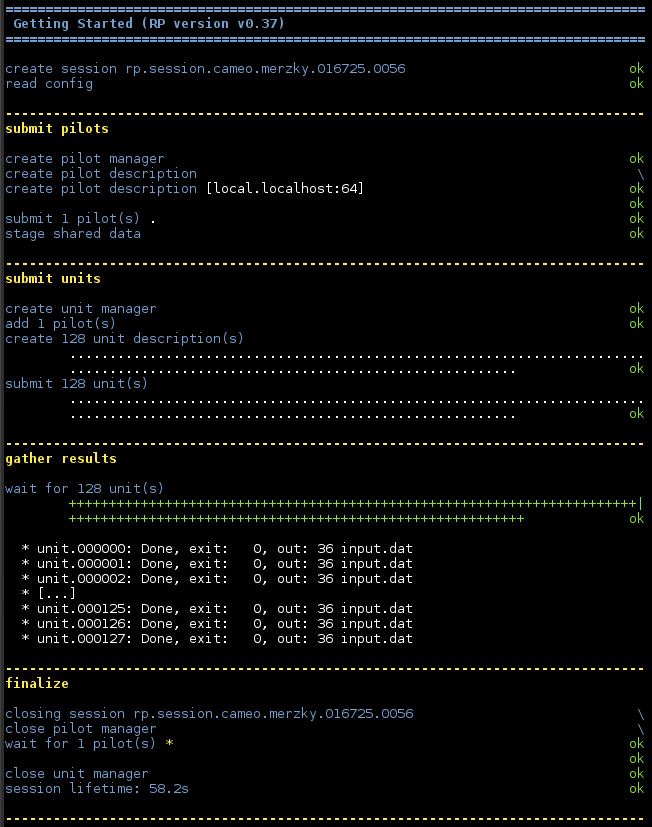

.. _chapter_user_guide_07:

***********************
Sharing Unit Input Data
***********************

RP supports the concurrent execution of many tasks and, often, these tasks
share some or all their input data, i.e., files. We have seen :ref:`earlier
<chapter_user_guide_05>` that input staging can incur a significant runtime
overhead. Such an overhead can be significantly reduced by avoiding redundant
file staging operations.

.. For this purpose, each RP pilot manages a space of shared data, and files put
.. into that space by the application can later be symlinked into the unit's
.. workdir, for consumption:

Each RP pilot manages a shared data space where to store units' input files.
First, RP can stage input files into the shared data space of a pilot. Second,
that pilot can create symbolic links (symlinks) in the work directory of each
unit to any file in the shared data space. In this way, set of units can
access the same file, avoiding costly staging and replicating operations.

.. code-block:: python

    # stage shared data from `pwd` to the pilot's shared data space
    pilot.stage_in({'source': 'file://%s/input.dat' % os.getcwd(),
                    'target': 'staging:///input.dat',
                    'action': rp.TRANSFER})

    [...]

    # create a symlink in the work directory of each unit to the file
    # input.dat
    for i in range(0, n):

        cud = rp.ComputeUnitDescription()

        cud.executable     = '/usr/bin/wc'
        cud.arguments      = ['-c', 'input.dat']
        cud.input_staging  = {'source': 'staging:///input.dat', 
                              'target': 'input.dat',
                              'action': rp.LINK}

The `rp.LINK` staging action creates a symlink, avoiding the copy operation
used by the `rp.TRANSFER` action.  The full example can be found here:
:download:`07_shared_unit_data.py <../../../examples/07_shared_unit_data.py>`.

.. note:: Unlike other methods in RP, the `pilot.stage_in` method is
          *synchronous*, i.e., it only returns once the transfer is completed.
          This may change in a future version of RP.

Running the Example
-------------------

The output of ``07_shared_unit_data.py`` is the same as we saw in the
:ref:`previous <chapter_user_guide_05>` section, but the script should run
significantly faster due to the removed staging redundancy, especially for
non-local pilots:

What's Next?
------------

This completes the discussion on data staging. The next sections offer more
details about unit execution: 
:ref:`environment setup <chapter_user_guide_08>`, 
:ref:`pre- and post- execution <chapter_user_guide_10>`, and 
:ref:`MPI applications <chapter_user_guide_09>`.
