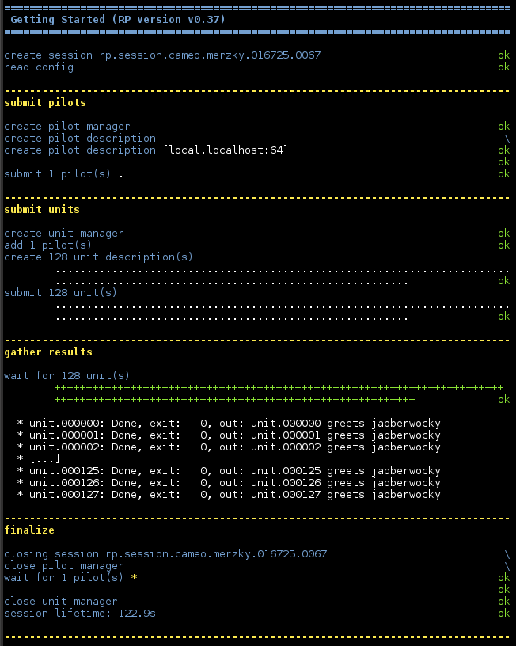

.. _chapter_user_guide_10:

**********************************
Using Pre- and Post- exec commands
**********************************

In some cases, applications (and thus CUs) need more complex and customizable
setup routines than can be expressed via :ref:`environment <chapter_user_guide_08>`
or :ref:`MPI flags <chapter_user_guide_09>`.  A frequent example is the use of
`module load` commands on various HPC resources, which are used to prepare
application runtime environments in a well defined, system specific way.

RP supports the invocation of such commands via the `pre_exec` and `post_exec`
keys for the CU descriptions.  

.. note:: Pre- and Post- execution is performed on the *resource headnode* --
    abuse of these commands for any compute or I/O heavy loads can lead to
    serious consequences, and will likely draw the wrath of the system
    administrators upon you!  You have been warned...

The code example below exemplarily demonstrates the same environment setup we
have been using in an earlier section, but now rendered via an `pre_exec`
command:

.. code-block:: python

    cud = rp.ComputeUnitDescription()

    cud.pre_exec    = ['export TEST=jabberwocky']
    cud.executable  = '/bin/echo'
    cud.arguments   = ['$RP_UNIT_ID greets $TEST']

which again will make the environment variable `TEST` available during CU execution.

Running the Example
-------------------

:download:`10_pre_and_post_exec.py <../../../examples/10_pre_and_post_exec.py>`.
uses the above blob to run a bag of `echo` commands:

What's Next?
------------

The RP User-Guide concludes with this section.  We recommend to check out the RP
API documentation next, and use it to write an RP application to run your own
workload.  Ii is easiest to do so by starting off with the 
:download:`canonical example <../../../examples/10_pre_and_post_exec.py>`, and
then add bits and pieces from the various user :ref:`<chapter_user_guide>`
sections as needed.

