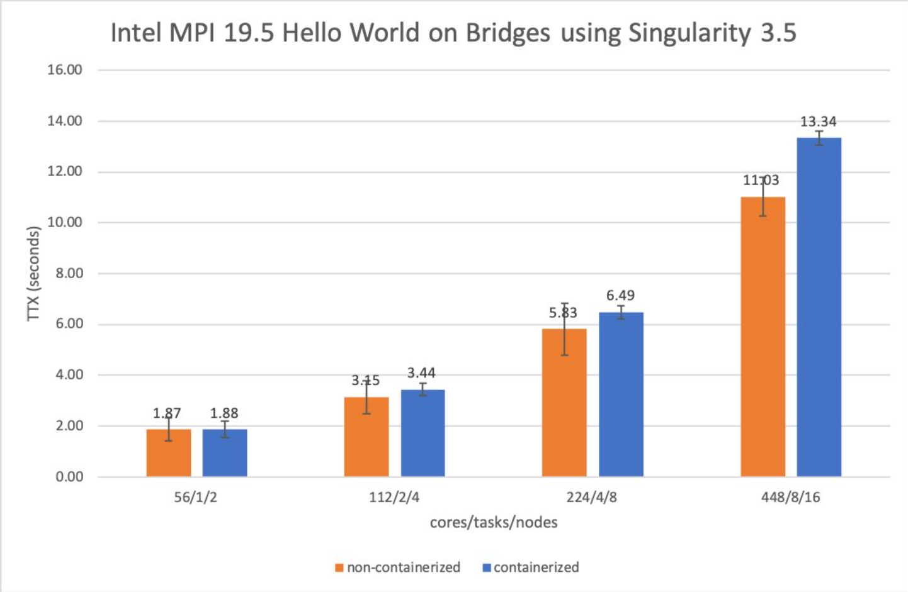
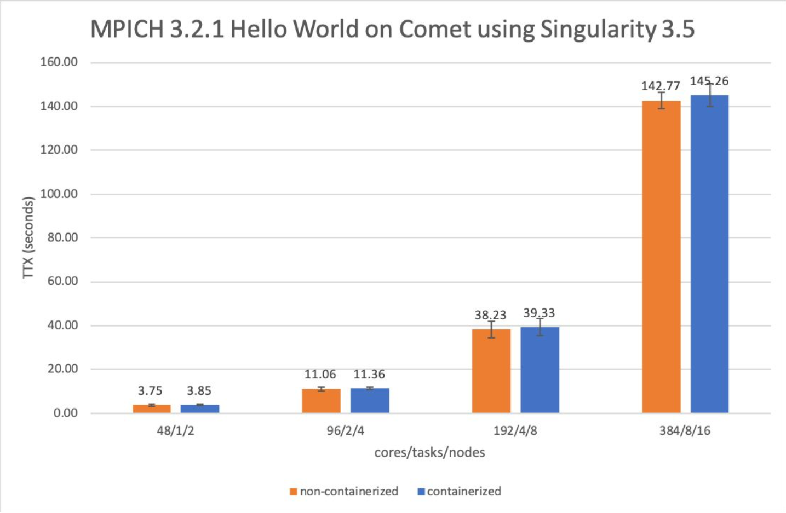

.. _chapter_user_guide_11:

**********************************
Using containerized compute units
**********************************

The present document aims to be a walkthrough of how to create MPI applications 
inside Singularity containers and run them on a remote HPC cluster. We will use 
Bridges as our cluster and the Intel MPI implementation that comes by default 
installed on it. We will assume the Bind approach as our method of creating the 
container, and familiarity on how to connect to Bridges.

If you want to learn more about the Bind vs Hybrid approach, please refer to:
`Bind vs Hybrid Model <https://sylabs.io/guides/3.5/user-guide/mpi.html>`_

If you want to run your experiment using the Hybrid model, or perhaps in a 
different cluster like Comet or under a different MPI implementation, there is 
an example for each case on thee following repo: 
`<https://github.com/radical-group/koubbe/tree/master/Containers/First%20experiments/src/exp2>`_

What is a container?
-------------------

A container is a standard unit of software that packages up code and all 
its dependencies so the application runs quickly and reliably from one 
computer environment to another. A container image is a lightweight standalone, 
executable package of software that includes everything needed to run an 
application: code, runtime, system tools, system libraries and settings.

The image becomes a container at runtime, and said containerized software will 
always run the same, regardless of the infrastructure, ensuring that it works 
uniformly despite differences for instance between development and staging.

What is Singularity?
-------------------

Singularity is a container runtime that favors integration while still 
preserving security restrictions on the container, and providing reproducible 
images. Furthermore, it enables users to have full control of their environment. 
Singularity containers can be used to package entire scientific workflows, 
software and libraries, and even data. This means that you do not have to ask 
your cluster administrator to install anything for you, you can put it in a 
Singularity container and run.

In order to see the Initial Presentation on Containers, please visit 
`Containers Initial Presentation <https://github.com/radical-group/koubbe/blob/master/Containers/First%20experiments/docs/Containers%20Initial%20Presentation.pdf>`_

If you want to take a deeper look into containers and Singularity, please refer to 
the following document:

`Case Studies of executing containerized scientific applications on High-Performance 
Computing Platforms using RADICAL-Cybertools <https://github.com/radical-group/koubbe/blob/master/Misc/Technical%20Report/GeorgeKoubbe_Report.pdf>`_

Step-by-step on Bridges directly
-------------------

Alright, let's dive right in.

.. code-block::

    1. First off let's start by login in to a Bridges login node.

    2. Load the Singularity module:

    $ module load singularity

    3. Pull the CentOS 7 image from the Docker Hub and build the Singularity container:

    $ singularity build centos-openmpi.sif docker://centos:centos7

    4. Download the MPI Hello World code in C:

    $ wget https://raw.githubusercontent.com/wesleykendall/mpitutorial/gh-pages/tutorials/mpi-hello-world/code/mpi_hello_world.c

    5. Request Bridges resources through the interactive method:

    $ interact -p RM -N 2 -n 8 -t 8:00:00

    6. Now, on a compute node, we load the Singularity module:

    $ module load singularity

    7. Export the following variables:

    $ export SINGULARITYENV_PREPEND_PATH=/opt/intel/compilers_and_libraries_2019.5.281/linux/mpi/intel64/bin/

    $ export SINGULARITYENV_LD_LIBRARY_PATH=/opt/intel/compilers_and_libraries_2019.5.281/linux/mpi/intel64/lib:/opt/intel/compilers_and_libraries_2019.5.281/linux/mpi/intel64/libfabric/lib

    8. Build the MPI C code:

    $ mpicc mpi_hello_world.c -o hello_world_intel

    9. Run the MPI application inside the Singularity container:

    $ mpirun -n 4 -ppn 2 singularity exec --bind /opt/intel/compilers_and_libraries_2019.5.281/linux/mpi/intel64 $HOME/centos-openmpi.sif $HOME/hello_world_intel

Congratulations if you made it this far! You were able to build your 
own MPI application inside a Singularity container and run it on 
Bridges directly. However, you built the container from a preexisting 
Docker image. If you want to learn how to build it from your own 
definition file, you can check the following link:

`Build a container <https://sylabs.io/guides/3.5/user-guide/build_a_container.html>`_

Step-by-step through RADICAL-Pilot
-------------------

.. code-block:: python

    #!/usr/bin/env python

    import os
    import sys
    import time

    verbose  = os.environ.get('RADICAL_PILOT_VERBOSE', 'REPORT')
    os.environ['RADICAL_PILOT_VERBOSE'] = verbose

    os.environ['RADICAL_PILOT_PROFILE'] = "True"
    os.environ['RADICAL_LOG_LVL'] = "DEBUG"
    os.environ['RADICAL_LOG_TGT'] = "radical.log"
    os.environ['RADICAL_PROFILE'] = "TRUE"

    import radical.pilot as rp
    import radical.utils as ru

    if __name__ == '__main__':

        start_time = time.time()

        # we use a reporter class for nicer output
        report = ru.Reporter(name='radical.pilot')
        report.title('Getting Started (RP version %s)' % rp.version)

        # use the resource specified as argument, fall back to localhost
        if   len(sys.argv)  > 3: report.exit('Usage:\t%s [tasks] [resource]\n\n' % sys.argv[0])
        elif len(sys.argv) == 3: tasks = int(sys.argv[1]); resource = sys.argv[2]
        elif len(sys.argv) == 2: tasks = int(sys.argv[1]); resource = 'local.localhost'
        else                   : tasks = 1; resource = 'local.localhost'

        # Create a new session. No need to try/except this: if session creation
        # fails, there is not much we can do anyways...
        session = rp.Session()

        # all other pilot code is now tried/excepted.  If an exception is caught, we
        # can rely on the session object to exist and be valid, and we can thus tear
        # the whole RP stack down via a 'session.close()' call in the 'finally'
        # clause...
        try:

            report.header('submit pilots')

            # Add a Pilot Manager. Pilot managers manage one or more ComputePilots.
            pmgr = rp.PilotManager(session=session)

            # Define an [n]-core local pilot that runs for [x] minutes
            # Here we use a dict to initialize the description object
            if (resource == 'local.localhost'):
                pd_init = {'resource'      : resource,
                    'runtime'       : 10,  # pilot runtime (min)
                    'exit_on_error' : True,
                    'cores'         : tasks*56
                    }
            else:
                pd_init = {'resource'      : resource,
                    'runtime'       : 30,  # pilot runtime (min)
                    'exit_on_error' : True,
                    'project'       : 'mc3bggp',
                    'queue'         : 'RM',
                    'access_schema' : 'gsissh',
                    'cores'         : tasks*56
                    }
            pdesc = rp.ComputePilotDescription(pd_init)

            # Launch the pilot.
            pilot = pmgr.submit_pilots(pdesc)

            report.header('submit units')

            # Register the ComputePilot in a UnitManager object.
            umgr = rp.UnitManager(session=session)
            umgr.add_pilots(pilot)

            # Create a workload of ComputeUnits.

            n = tasks   # number of units to run
            t_num = 1  # number of threads   (OpenMP)
            p_num = n*56  # number of processes (MPI)
            report.info('create %d unit description(s)\n\t' % n)

            cuds = list()
            for i in range(0, n):

                # create a new CU description, and fill it.
                # Here we don't use dict initialization.
                cud = rp.ComputeUnitDescription()
                #---------- Executable_Bridges ----------
                # To run, place executable in Bridges and compile: $ mpicc -o mpi_hello_world mpi_hello_world.c
                # if on Bridges directly, run with: mpirun -n 4 -ppn 2 -host r001,r002 ./mpi_hello_world 
                #cud.executable  = '/home/karahbit/hello_world_intel'
                #---------- Singularity_Bridges ---------
                cud.pre_exec    = []
                cud.pre_exec   += ['export SINGULARITYENV_PREPEND_PATH=/opt/intel/compilers_and_libraries_2019.5.281/linux/mpi/intel64/bin']
                cud.pre_exec   += ['export SINGULARITYENV_LD_LIBRARY_PATH=/opt/intel/compilers_and_libraries_2019.5.281/linux/mpi/intel64/lib:/opt/intel/compilers_and_libraries_2019.5.281/linux/mpi/intel64/libfabric/lib']
                cud.executable   = 'singularity'
                cud.arguments    = []
                cud.arguments   += ['exec']
                cud.arguments   += ['--bind', '/opt/intel/compilers_and_libraries_2019.5.281/linux/mpi/intel64']
                cud.arguments   += ['/home/karahbit/centos-openmpi.sif']
                cud.arguments   += ['/home/karahbit/hello_world_intel']
                cud.cpu_processes       = p_num
                cud.cpu_process_type    = rp.MPI
                cud.cpu_threads         = t_num
                cuds.append(cud)
                report.progress()
            report.ok('>>ok\n')

            # Submit the previously created ComputeUnit descriptions to the
            # PilotManager. This will trigger the selected scheduler to start
            # assigning ComputeUnits to the ComputePilots.
            umgr.submit_units(cuds)

            # Wait for all compute units to reach a final state (DONE, CANCELED or FAILED).
            report.header('gather results')
            umgr.wait_units()

        except Exception as e:
            # Something unexpected happened in the pilot code above
            report.error('caught Exception: %s\n' % e)
            ru.print_exception_trace()
            raise

        except (KeyboardInterrupt, SystemExit):
            # the callback called sys.exit(), and we can here catch the
            # corresponding KeyboardInterrupt exception for shutdown.  We also catch
            # SystemExit (which gets raised if the main threads exits for some other
            # reason).
            ru.print_exception_trace()
            report.warn('exit requested\n')

        finally:
            # always clean up the session, no matter if we caught an exception or
            # not.  This will kill all remaining pilots.
            report.header('finalize')
            session.close(download=True)

        report.header()

        print("--- %s seconds ---" % (time.time() - start_time))
        
And you can run it by typing the following command, where "x" is the
number of MPI processes you would like to spawn:

``python mpi_rp.py x xsede.bridges``

Below are the results of the above experiment, showing the overhead 
obtained when running, through RP, a containerized MPI Hello World 
application (blue bars), against the non-containerized version (orange
bars). We can appreciate an overhead of 0.5%, 9%, 11% and 21% for 2, 4, 8 
and 16 nodes respectively. 

It's worth noting that the same experiment running on Comet gives
us less noticeable overheads. A container overhead of around 2% was 
achieved in all cases. Although execution times are considerably higher 
than on Bridges, the overheads are much lower and consistent.

